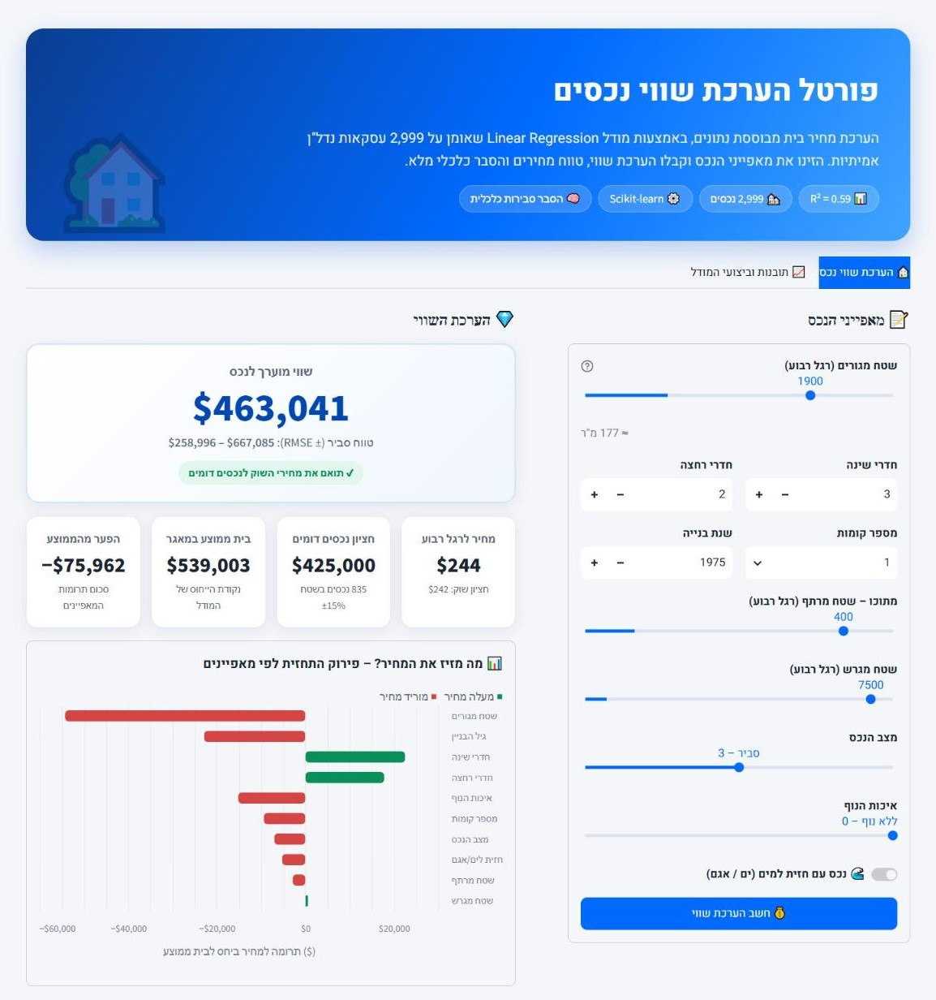
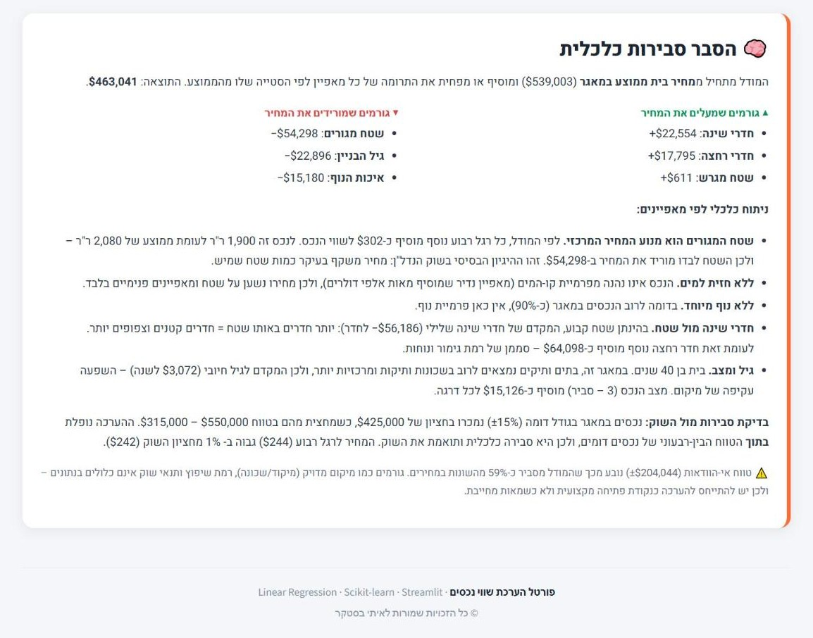
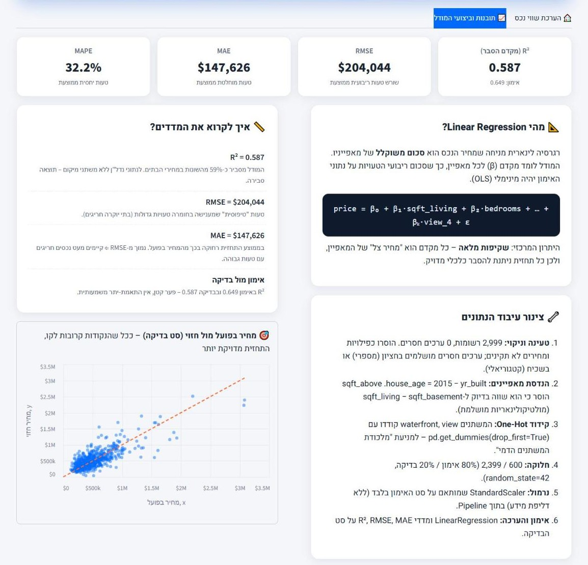
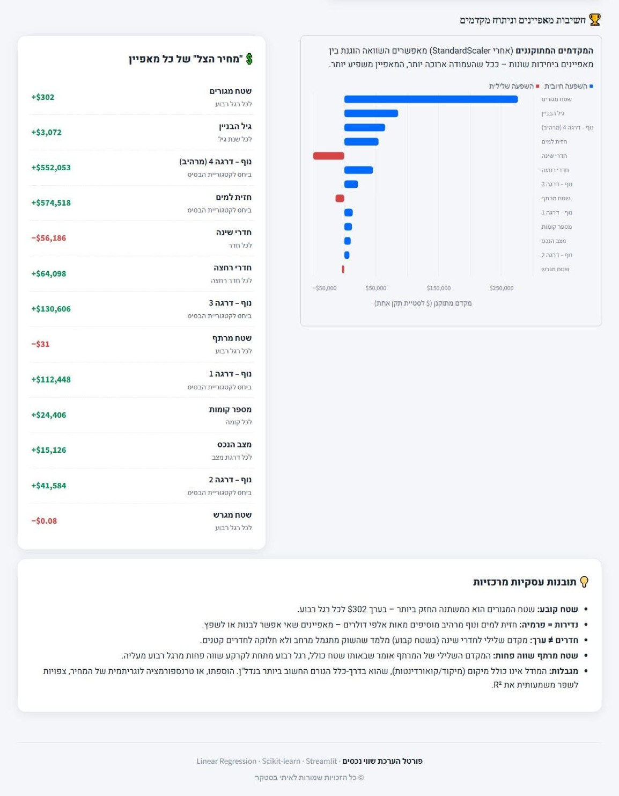

<div dir="rtl">

# 🏡 חיזוי מחירי בתים – House Price Prediction

[](https://housepricepred-ai.streamlit.app/)


> **חלק א' של מטלת Machine Learning** – בניית מודל **Linear Regression** לחיזוי מחיר בית, הערכתו במדדי **R², RMSE, MAE**, ופריסתו כפורטל הערכת שווי אינטראקטיבי ב-**Streamlit**, בעברית מלאה ובממשק RTL.

> 🔗 **Live Demo:** [housepricepred-ai.streamlit.app](https://housepricepred-ai.streamlit.app/) – האפליקציה פרוסה ב-Streamlit Community Cloud וזמינה לשימוש ישירות מהדפדפן, ללא התקנה.

---

## 📌 תקציר מנהלים

| נושא | פירוט |
|---|---|
| **מטרה עסקית** | הערכת שווי שוק של בית מגורים לפי מאפייניו הפיזיים, עם הסבר שקוף לכל תחזית |
| **נתונים** | 2,999 עסקאות נדל"ן, 12 עמודות (מחיר, שטחים, חדרים, נוף, חזית למים, מצב, שנת בנייה) |
| **מודל** | `LinearRegression` (OLS) בתוך `Pipeline` עם `StandardScaler` |
| **דיוק על סט הבדיקה** | **R² = 0.587** · **RMSE = $204,044** · **MAE = $147,626** |
| **תוצר** | אפליקציית Streamlit בעברית: כלי הערכת שווי + "הסבר סבירות כלכלית" + לוח תובנות מודל |

---

## 🖥️ ממשק האפליקציה

<p align="center">
  
</p>
<p align="center"><b>איור 1 – כלי הערכת השווי האינטראקטיבי.</b> המשתמש מזין את מאפייני הנכס (מימין) ומקבל מיד שווי מוערך עם טווח של ± RMSE, השוואה לחציון של נכסים דומים, ותרשים שמפרק את התחזית לתרומה של כל מאפיין ביחס לבית ממוצע.</p>

<p align="center">
  
</p>
<p align="center"><b>איור 2 – הסבר סבירות כלכלית.</b> לכל תחזית נוצר הסבר דינמי: נקודת הייחוס (בית ממוצע), הגורמים שמעלים ומורידים את המחיר, ניתוח כלכלי לפי מאפיין, ובדיקת סבירות מול טווח המחירים של נכסים דומים במאגר.</p>

<p align="center">
  
</p>
<p align="center"><b>איור 3 – ביצועי המודל.</b> כרטיסי R², RMSE, MAE ו-MAPE על סט הבדיקה, הסבר על Linear Regression ועל צינור עיבוד הנתונים, ותרשים מחיר בפועל מול חזוי – ככל שהנקודות קרובות לקו המקווקו, התחזית מדויקת יותר.</p>

<p align="center">
  
</p>
<p align="center"><b>איור 4 – חשיבות מאפיינים וניתוח מקדמים.</b> המקדמים המתוקננים (אחרי StandardScaler) מדרגים את עוצמת ההשפעה של כל מאפיין, ולצידם "מחיר הצל" ביחידות אמיתיות ותובנות עסקיות מרכזיות.</p>

עיצוב בהשראת פורטלי נדל"ן מובילים: כרטיסים נקיים, צללים רכים, גופן Heebo, **RTL מלא** ותצוגה **רספונסיבית** למובייל, טאבלט ומחשב.

---

## 📏 מדדי הערכה – הסבר מעמיק

כל המדדים מחושבים על **סט הבדיקה בלבד** (600 נכסים שהמודל לא ראה באימון), כך שהם משקפים את ביצועי המודל על נכסים חדשים. נסמן: $y_i$ – המחיר בפועל, $\hat{y}_i$ – המחיר החזוי, $\bar{y}$ – המחיר הממוצע, $n$ – מספר הנכסים.

### תמונת מצב

| מדד | אימון | **בדיקה** | מודל נאיבי* | שיפור מול הנאיבי |
|---|---|---|---|---|
| **R²** | 0.649 | **0.587** | 0.000 | – |
| **RMSE** | $233,677 | **$204,044** | $318,011 | **−36%** |
| **MAE** | $154,437 | **$147,626** | $218,491 | **−32%** |
| **MAPE** | – | **32.2%** | – | – |

<sub>* מודל נאיבי = חיזוי המחיר הממוצע של סט האימון לכל בית. זהו "רף המינימום" – כל מודל שימושי חייב לנצח אותו.</sub>

### 1️⃣ R² – מקדם ההסבר (R-squared)

$$R^2 = 1 - \frac{\sum_i (y_i - \hat{y}_i)^2}{\sum_i (y_i - \bar{y})^2}$$

**מה הוא מודד?** איזה חלק מה**שונות** במחירי הבתים המודל מצליח להסביר, ביחס למודל נאיבי שתמיד מנחש את הממוצע. ‎R² = 1 פירושו חיזוי מושלם; ‎R² = 0 פירושו שהמודל לא טוב יותר מהממוצע (על סט בדיקה הערך יכול אף להיות שלילי).

**למה בחרנו בו?** זהו המדד המקובל ביותר לרגרסיה לינארית, והוא **חסר יחידות** – ולכן מאפשר להשוות בין מודלים ומאגרי נתונים שונים, ולתקשר להנהלה "כמה מהתמונה המודל רואה".

**איך לפרש את התוצאה שלנו?**
- **‎R² = 0.587** – המאפיינים הפיזיים של הבית (שטח, חדרים, נוף, חזית למים, גיל, מצב) מסבירים כ-**59%** מהשונות במחירים.
- **41% הנותרים** נובעים בעיקר מגורמים שאינם בנתונים – בראשם **מיקום** (שכונה, מיקוד, קרבה למרכז), שבנדל"ן הוא לרוב הגורם החשוב ביותר.
- **הפער בין אימון (0.649) לבדיקה (0.587) קטן** (≈0.06) – המודל **מכליל היטב** ואין סימן ל-Overfitting משמעותי. זה צפוי ממודל לינארי עם 13 מאפיינים בלבד ו-2,399 תצפיות אימון.

### 2️⃣ RMSE – שורש טעות ריבועית ממוצעת (Root Mean Squared Error)

$$RMSE = \sqrt{\frac{1}{n}\sum_i (y_i - \hat{y}_i)^2}$$

**מה הוא מודד?** את גודל הטעות ה"טיפוסי" **בדולרים**. בגלל ההעלאה בריבוע, טעות של $400K "נענשת" פי 4 מטעות של $200K – כלומר RMSE **רגיש במיוחד לטעויות גדולות**.

**למה בחרנו בו?**
- הוא ביחידות של משתנה המטרה (דולרים), ולכן מובן ישירות לאנשי עסקים.
- בנדל"ן **טעות גדולה יקרה באופן לא פרופורציונלי** – הערכת-חסר של $400K בבית יוקרה גרועה בהרבה משתי טעויות של $200K. RMSE משקף את זה.
- זו בדיוק הפונקציה ש-OLS (Linear Regression) ממזער באימון, כך שהמדד עקבי עם אופן אימון המודל.

**איך לפרש את התוצאה שלנו?**
- **RMSE = $204,044** – כ-39% מהמחיר הממוצע בסט הבדיקה ($520,669). זה גבוה בערכים יחסיים, אך **נמוך ב-36% מהמודל הנאיבי** ($318,011).
- באפליקציה, RMSE משמש לבניית **טווח המחירים הסביר** (תחזית ± RMSE). בפועל, **76% מהנכסים** בסט הבדיקה נמצאים בתוך הטווח הזה.
- **5% מהנכסים עם הטעות הגדולה ביותר אחראים ל-44% מסך הטעות הריבועית** – כלומר RMSE "נמשך למעלה" בעיקר בגלל מספר קטן של בתי יוקרה חריגים.

### 3️⃣ MAE – טעות מוחלטת ממוצעת (Mean Absolute Error)

$$MAE = \frac{1}{n}\sum_i \left| y_i - \hat{y}_i \right|$$

**מה הוא מודד?** בכמה דולרים, **בממוצע**, התחזית רחוקה מהמחיר בפועל – כאשר כל טעות נספרת באופן ליניארי, ללא העדפה לטעויות גדולות.

**למה בחרנו בו?**
- זה המדד ה**אינטואיטיבי** ביותר: "בממוצע המודל טועה ב-X דולר".
- הוא **עמיד לחריגים** – לכן ההשוואה בינו לבין RMSE מלמדת על התפלגות הטעויות.

**איך לפרש את התוצאה שלנו?**
- **MAE = $147,626** – טעות ממוצעת של כ-28% מהמחיר הממוצע. חציון הטעות המוחלטת נמוך עוד יותר: **$111,550** – כלומר בחצי מהנכסים הטעות קטנה מכך.
- **היחס RMSE / MAE = 1.38.** כשהטעויות מתפלגות נורמלית היחס צפוי להיות כ-1.25; יחס גבוה יותר מאשר ש**התפלגות הטעויות בעלת "זנב כבד"** – רוב התחזיות סבירות, ומיעוט קטן של נכסים חריגים מייצר טעויות גדולות במיוחד.

### 🔍 ניתוח טעויות לפי פלח מחיר

| פלח מחיר | מס' נכסים | MAE | MAPE | הטיה ממוצעת* |
|---|---|---|---|---|
| עד $500K | 347 | $122,217 | 38.5% | **+$61,403** (הערכת-יתר) |
| ‎$500K–$1M | 222 | $157,914 | 23.7% | −$34,813 |
| מעל $1M | 31 | $358,373 | 23.7% | **−$237,787** (הערכת-חסר) |

<sub>* הטיה = ממוצע (חזוי − בפועל). ערך חיובי = המודל מעריך ביתר.</sub>

**מסקנות:**
- המודל **מעריך ביתר בתים זולים ומעריך בחסר בתי יוקרה** – דפוס קלאסי של מודל לינארי שמנסה להתאים קו ישר לקשר שאינו לינארי לגמרי (פרמיית היוקרה גדלה מהר יותר מהשטח).
- בפלחים הבינוני והיקר הטעות **היחסית** (MAPE ≈ 24%) טובה בהרבה מאשר בפלח הזול – הטעות בדולרים גדלה עם המחיר, אבל באחוזים היא דווקא קטנה.
- **כיוון שיפור מתבקש:** חיזוי של ‎`log(price)` במקום המחיר עצמו – יהפוך את הטעויות ליחסיות, יקטין את ההטיה בקצוות ויפחית את השפעת החריגים על RMSE.

### 🧭 שורה תחתונה למקבלי החלטות

> המודל הוא **כלי הערכה ראשונית אמין ושקוף**: הוא מסביר את רוב השונות במחירים מתוך מאפיינים פיזיים בלבד, מכליל היטב לנכסים חדשים, ומשפר משמעותית את הניחוש הנאיבי. עם זאת, טעות טיפוסית של כ-$150K–$200K מחייבת להתייחס לתוצאה כ**נקודת פתיחה** ולא כשמאות מחייבת – במיוחד עבור נכסי יוקרה, שבהם המודל נוטה להעריך בחסר.

---

## 🔧 צינור הנתונים (Data Pipeline)

```
CSV / XLSX ──► ניקוי וטיפול בערכים חסרים ──► הנדסת מאפיינים ──► One-Hot Encoding
          ──► Train/Test Split (80/20) ──► StandardScaler ──► LinearRegression ──► R² · RMSE · MAE
```

1. **טעינה** – הקוד מאתר אוטומטית את הקובץ `Project housing data` בפורמט `.csv` או `.xlsx` (`find_data_file`).
2. **ניקוי וטיפול בערכים חסרים** – הסרת כפילויות ורשומות ללא מחיר/מחיר לא תקין; ערכים חסרים מושלמים ב**שכיח** (משתנים קטגוריאליים) או ב**חציון** (משתנים מספריים). כמו כן `SimpleImputer` בתוך ה-Pipeline משמש רשת ביטחון לנתונים חדשים. *(בקובץ הנוכחי: 0 ערכים חסרים.)*
3. **הנדסת מאפיינים**
   - `house_age = 2015 − yr_built` – גיל הבית פרשני יותר משנת בנייה.
   - **הסרת `sqft_above`** – בנתונים מתקיים בדיוק `sqft_living = sqft_above + sqft_basement`. השארת שלושתם יוצרת **מולטיקולינאריות מושלמת** ומקדמים לא יציבים.
4. **קידוד (Encoding)** – ראו סעיף נפרד למטה.
5. **חלוקה** – 2,399 אימון / 600 בדיקה (`test_size=0.2`, `random_state=42`).
6. **נרמול (Feature Scaling)** – `StandardScaler` מותאם **על סט האימון בלבד** בתוך `Pipeline`, ולכן אין דליפת מידע (Data Leakage) לסט הבדיקה.
7. **אימון והערכה** – `LinearRegression` ומדדי R², RMSE, MAE על סט הבדיקה.

---

## 🧩 קידוד הנתונים (Encoding)

| משתנה | סוג | טיפול | הנימוק |
|---|---|---|---|
| `waterfront` | בינארי (0/1) – משתנה דמי | `pd.get_dummies` ⇐ `waterfront_1` | מאפיין איכותי "יש/אין" |
| `view` | קטגוריאלי (0–4) | `pd.get_dummies` ⇐ `view_1` … `view_4` | הפער בין דרגות נוף אינו בהכרח שווה; One-Hot מאפשר פרמיה נפרדת לכל דרגה |
| `condition` | סדר (1–5) | נשאר מספרי | הסקאלה סדורה ומרווחיה אחידים יחסית |
| שאר המשתנים | רציפים / ספירה | נשארו מספריים + `StandardScaler` | – |

**`drop_first=True`** – קטגוריית הבסיס (ללא חזית למים / ללא נוף) מושמטת כדי להימנע מ**מלכודת המשתנים הדמי** (Dummy Variable Trap). לכן כל מקדם דמי מתפרש כ**פרמיה ביחס לקטגוריית הבסיס**.

---

## 💲 ניתוח מקדמים – "מחיר הצל" של כל מאפיין

| מאפיין | מקדם ליחידה | חשיבות (מקדם מתוקנן) | פירוש כלכלי |
|---|---|---|---|
| שטח מגורים `sqft_living` | **+$302** לרגל רבוע | 🥇 הגבוהה ביותר | מחיר משקף בעיקר כמות שטח שמיש |
| גיל הבית `house_age` | +$3,072 לשנה | 🥈 | בתים ותיקים ממוקמים בשכונות ותיקות ומרכזיות – השפעה עקיפה של מיקום |
| נוף מרהיב `view_4` | +$552,053 | 🥉 | נוף הוא מוצר נדיר שאי אפשר לשכפל |
| חזית למים `waterfront_1` | +$574,518 | גבוהה | רק ~1% מהנכסים – היצע מוגבל = פרמיה גבוהה |
| חדרי שינה `bedrooms` | −$56,186 לחדר | גבוהה | **בשטח קבוע** – יותר חדרים = חדרים קטנים וצפופים |
| חדרי רחצה `bathrooms` | +$64,098 | בינונית | סממן לרמת גימור ונוחות |
| שטח מרתף `sqft_basement` | −$31 לרגל רבוע | נמוכה | בשטח כולל קבוע, רגל רבוע במרתף שווה פחות מרגל רבוע מעל הקרקע |
| מצב הנכס `condition` | +$15,126 לדרגה | נמוכה | נכס מתוחזק דורש פחות השקעה מהקונה |
| שטח מגרש `sqft_lot` | ≈ 0 | זניחה | משפיע מעט מאוד כאשר שטח הבית כבר במודל |

---

## 🧠 תחזית לדוגמה והסבר סבירות כלכלית

**נכס לדוגמה (בית משפחתי טיפוסי):** 3 חדרי שינה · 2 חדרי רחצה · 1,900 ר"ר מגורים (כולל 400 ר"ר מרתף) · מגרש 7,500 ר"ר · קומה אחת · ללא נוף/חזית למים · מצב 3 · נבנה ב-1975.

| | ערך |
|---|---|
| **מחיר חזוי** | **$463,041** |
| טווח סביר (± RMSE) | $258,996 – $667,085 |
| בית ממוצע במאגר (נקודת ייחוס) | $539,003 |
| חציון 835 נכסים בגודל דומה (±15%) | $425,000 (רבעונים: $315,000 – $550,000) |
| מחיר לרגל רבוע | $244 (חציון שוק: $242) |

**פירוק התחזית** – בגלל שהמודל לינארי, ניתן לפרק את התחזית במדויק: *מחיר = בית ממוצע + Σ מקדם × (ערך − ממוצע)*

| גורם | תרומה ביחס לבית ממוצע |
|---|---|
| שטח מגורים (1,900 לעומת ממוצע 2,080) | −$54,298 |
| גיל הבית (40 שנה, צעיר מהממוצע) | −$22,896 |
| חדרי שינה (3 – פחות מהממוצע, בשטח נתון) | +$22,554 |
| חדרי רחצה | +$17,795 |
| ללא נוף | −$15,180 |
| שאר המאפיינים | −$23,937 |
| **סה"כ** | **−$75,962 ⇐ $463,041** |

**למה המחיר הגיוני כלכלית?**
- הבית **קטן ב-9% מהממוצע**, ללא נוף וללא חזית למים – ולכן מתומחר מתחת לבית הממוצע.
- **המחיר לרגל רבוע ($244) כמעט זהה לחציון השוק ($242)** – התמחור עקבי עם השוק.
- התחזית נופלת **בתוך הטווח הבין-רבעוני** ($315K–$550K) של 835 נכסים בגודל דומה, וקרובה לחציון שלהם ($425K).
- ⇐ **המסקנה: ההערכה סבירה ומבוססת**. היא אינה שמאות מחייבת – הטווח של ±RMSE משקף גורמים שאינם בנתונים (מיקום מדויק, רמת שיפוץ, תנאי שוק).

באפליקציה, הסבר זה **מחושב דינמית לכל נכס** שהמשתמש מזין – כולל גורמים מעלים/מורידים, ניתוח כלכלי לפי מאפיין, ובדיקת סבירות מול נכסים דומים.

---

## 🗂️ מבנה אפליקציית Streamlit

| לשונית | תוכן |
|---|---|
| **🏠 הערכת שווי נכס** | סליידרים ושדות קלט · כרטיס מחיר עם טווח · השוואה לנכסים דומים · גרף פירוק תרומות · **הסבר סבירות כלכלית** דינמי (איורים 1–2) |
| **📈 תובנות וביצועי המודל** | הסבר על Linear Regression · כרטיסי R², RMSE, MAE, MAPE · גרף בפועל מול חזוי · חשיבות מאפיינים ו"מחיר צל" · תובנות עסקיות (איורים 3–4) |

---

## 🚀 התקנה והרצה

```bash
# 1. שכפול הפרויקט
git clone https://github.com/itaybs/house-price-prediction.git
cd house-price-prediction

# 2. סביבה וירטואלית (מומלץ)
python -m venv .venv
# Windows:  .venv\Scripts\activate
# macOS/Linux:  source .venv/bin/activate

# 3. התקנת תלויות
pip install -r requirements.txt

# 4. אימון והערכה מהטרמינל (מדפיס מדדים, מקדמים ותחזית לדוגמה)
python train.py
#    או מתוך תיקייה המכילה את "Project housing data" (.csv / .xlsx):
python train.py --data "path/to/folder"

# 5. הרצת האפליקציה
streamlit run app.py
```

**פריסה ל-Streamlit Community Cloud:** האפליקציה פרוסה בכתובת [housepricepred-ai.streamlit.app](https://housepricepred-ai.streamlit.app/) ומתעדכנת אוטומטית בכל `push` לענף `main`. לפריסה עצמאית של עותק משלכם: התחברו ל-[share.streamlit.io](https://share.streamlit.io), בחרו את הריפו וקובץ ראשי `app.py`.

---

## 📁 מבנה הפרויקט

```
house-price-prediction/
├── app.py                 # אפליקציית Streamlit (עברית, RTL)
├── train.py               # אימון והערכה מהטרמינל
├── src/
│   └── house_model.py     # Pipeline: ניקוי, קידוד, נרמול, מודל, הסבר תחזית
├── data/
│   └── housing_data.csv   # מאגר הנתונים
├── reports/               # metrics.json, coefficients.csv (נוצרים ע"י train.py)
├── assets/                # צילומי מסך של האפליקציה (מוטמעים ב-README)
├── .streamlit/config.toml # ערכת עיצוב
├── requirements.txt
└── README.md
```

---

## ⚠️ מגבלות וכיווני שיפור

- **מיקום** – הוספת מיקוד/קואורדינטות צפויה לשפר משמעותית את R².
- **טרנספורמציה לוגריתמית** של המחיר – תתאים יותר להתפלגות המחירים המוטה ימינה ותקטין את השפעת החריגים.
- **מודלים מתקדמים** – Ridge/Lasso לרגולריזציה, או Gradient Boosting ללכידת אינטראקציות לא-לינאריות (במחיר של פחות שקיפות).

---

<p align="center" dir="rtl">© כל הזכויות שמורות לאיתי בסטקר</p>

</div>
